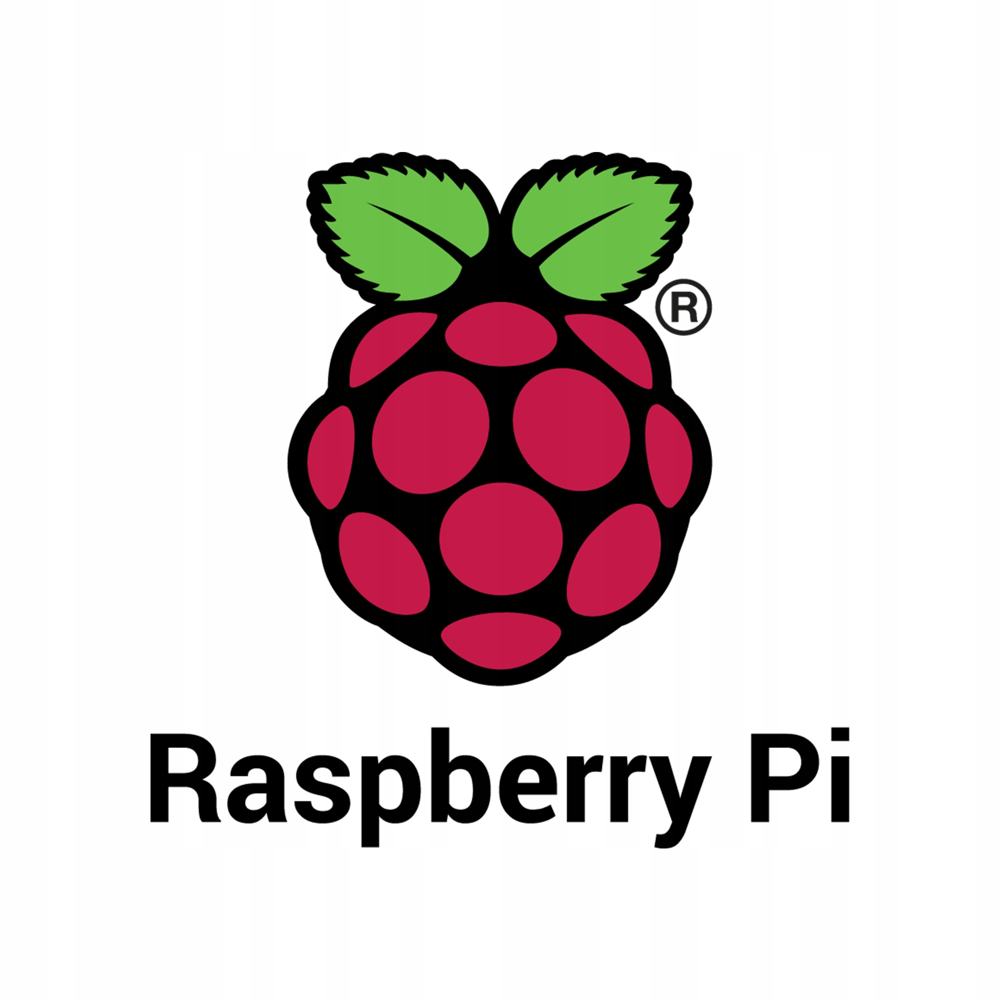

# Introduction to RaspberryPi

- Pre-workshop activities: 15 min 
- Introductory presentation: 5-10 min
- Hands-on activities: 80 min

## Why RaspberryPi? 

"[RaspberryPi](https://www.raspberrypi.com){:target="_blank"} is a low cost, credit-card sized computer that plugs into a computer monitor or TV, and uses a standard keyboard and mouse. It is a capable little device that enables people of all ages to explore computing, and to learn how to program in languages like Scratch and Python. It’s capable of doing everything you’d expect a desktop computer to do, from browsing the internet and playing high-definition video, to making spreadsheets, word-processing, and playing games.

What’s more, the Raspberry Pi  has the ability to interact with the outside world, and has been used in a wide array of digital maker projects, from music machines and parent detectors to weather stations and tweeting birdhouses with infra-red cameras. We want to see the Raspberry Pi being used by kids all over the world to learn to program and understand how computers work."

## Learning objectives

At the end of this workshop, you will be able to:

1. Setup the RaspberryPi hardware and software 
2. Have a basic understanding of terminal commands to navigate and move files.
3. Terminal commands for updating and upgrading the Pi. 
4. Editing files with Nano.
5. Cut and paste programming and editing with terminal-based text editors.
6. Be able to wire simple breadboard circuits with an introductory level understanding of electronics.
7. Have an understanding of what types of problems can be solved with a RaspberryPi.
9. Complete one or more of the following sample projects:
   - [Chromium Kiosk Computer](https://pimylifeup.com/raspberry-pi-kiosk/){:target="_blank"}
   - [Spotify Jukebox](https://pimylifeup.com/raspberry-pi-spotify/){:target="_blank"}
   - [NearbyAirtraffic Tracker](https://pimylifeup.com/raspberry-pi-flightradar24/){:target="_blank"}
   - [Networkwide Ad blocker](https://pimylifeup.com/raspberry-pi-pi-hole/){:target="_blank"}
   - Personal Minecraft (or any other server provided game) server

 
[NEXT STEP: Pre-Workshop Activities](pre-workshop.html){: .btn .btn-blue }
